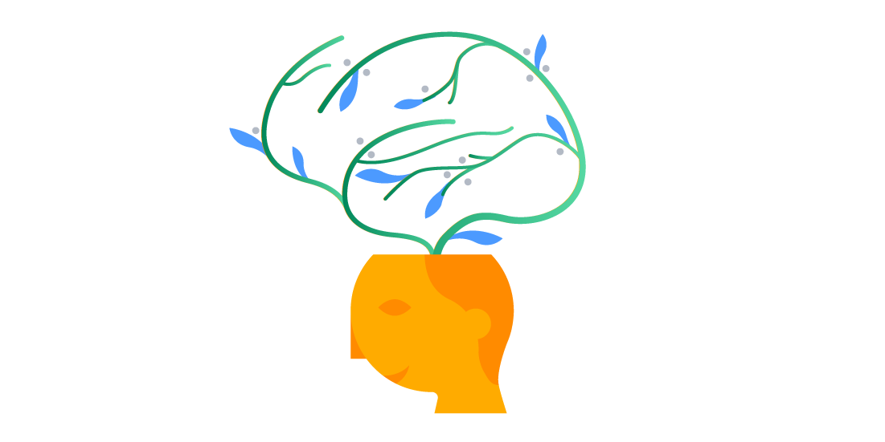

# Growth Mindset

***Growth Mindset it's a way to make you more positive about any problime you face***

## What is a growth mindset?

*Before going throw meaning of Growth Mindset look at this picture and tru to fighure it out*

............

### Fixed Mindset

 fixed mindset this mentality is just about how to give up fast, hate challenge, don't want any complicated thing and we need every thing solve by it self.

### growth mindset

It is a way to make you more success and give you a proper way to deal with problems and pressure, even if you intelligence and talent, that does not mean you can solve problem without growth mindset.

***Perseverance, gumption traps, and maintaining a growth mindset***

1. challenges : if you have faced a problem and you had try to solve it and you couldn't solve it, don't give up and try to solve it in other way.

2. Obstacles : when you face a Obstacle not just leave or ignore it, just be focus and try to overcome it. don't let anything disturb you.

3. Effort : i want you to remember anything you do and how much you push yourself hard you will get what you want, it is not easy word.

4. Criticism : make any Criticism like something push you to make more because any Criticism you get you must believe you are doing good.

5. Success of others : don't feel jealous but see how these these people how done it and learn.

***I want you not just follow these steps just in work only but in life***

