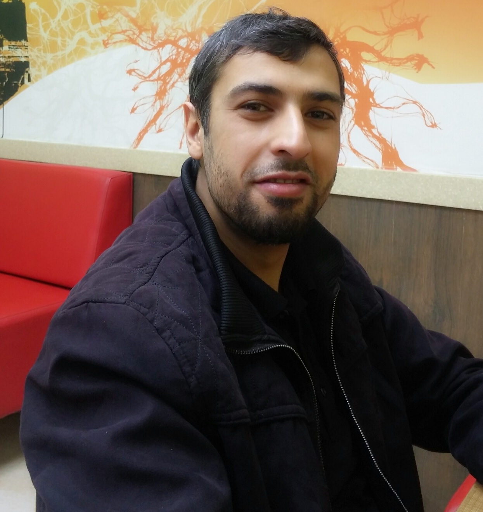

# Reading Notes

### This repo is to document and highlight the knowldge wich gained through the full-stack bootcamp with code fellows.

#### These are my daily reading assignments for Code Fellows Introduction to Software development Course. in this way  I am putting my skills to review and remmbering what I am learning in a better way.

 

# Odai Al-Fawaier

**Software Engineering**

 

## About Me

My name is ODAI i'm 30 years old, graduated from philadelphia university, i'm a freelance developer, i have knowledge with php, mysql, react.js, node.js,socket.io,mongodb.

 

## Contact Info

* Whatsapp: 00962789165865
* Email: odai22odai78@gmaill.com
* GitHub: [My GitHub](https://github.com/odai1990)

 

## Code 102 - Intro to Software Development

### Table of content

* [Text Editor](Read_lab01.md) 
* [Growth Mindset](Lab_02a.md) 
* [Markdown](Read_02a.md) 
* [github](Read_02b.md) 
* [Html](Read_03.md) 
* [Javascript_part_1](Read_3.md) 
* [Javascript_part_2](Read_4.md) 
* [Javascript_part_3](Read_05a.md) 
* [Css](Read_05b.md) 

## Code 201 - Foundations of Software Development

### Table of content

* [Html](class-01.md) 
* [Html-text-css&Javascript-decisions-loops](class-02.md) 
* [Html-text-css-2&Javascript-decisions-loops-2](class-03.md) 
* [Html-link-Layout&Functions, Methods, and Objects](class-04.md) 
* [Html-Text-Color-Image](class-05.md) 
* [Object-Literals](class-06.md) 
* [Tables, Functions, Methods, and Objects](class-07.md) 
* [Layout](class-08.md) 
* [Forms,Lists, Tables,Events](class-09.md) 
* [JavaScript book, Ch. 10, “Error Handling & Debugging](class-10.md) 
* [image,Practical Information,Flash](class-11.md) 
* [Chart.js, Canvas](class-12.md) 
* [Localstorage](class-13.md) 
* [CSS Transitions & Animations & Transforms](class-14.md) 
* [What Google Learned About Teams](class-14b.md) 

## Code 301 - Intermediate Software Development

### Table of content

 * [Responsive](read1.md)
 * [JQuery](read2.md) 
 * [MUSTACHE and FLEXBOX](read3.md) 
 * [CSS GRID](read4.md) 
 * [Heroku Deployment](read5.md) 
 * [Node, Express, and APIs](read6.md) 
 * [APIs continued](read7.md) 
 * [SQL](read8.md) 
 * [Refactoring](read9.md) 
 * [EJS](read11.md) 
 * [Components](read12.md) 
 * [Update/Delete](read13.md) 
 * [DB Normalization](read14a.md) 
 * [Project Ideas & APIs](read14b.md) 
 * [Diversity and Inclusion](read15.md) 

## Code 401 - Advanced Software Development

### Table of content

 * [Pain vs. Suffering & Big O](reading_1.md)
 * [Tests TDD with Python](reading_2.md)
 * [Reading and Writing Files in Python](reading_3.md)
 * [Classes and Objects](reading_4.md)
 * [Linked Lists](reading_5.md)
 * [Game of Greed 1](reading_6.md)
 * [Game of Greed 2](reading_7.md)
 * [Game of Greed 3](reading_8.md)
 * [Game of Greed 4](reading_9.md)
 * [Stacks and Queues](reading_10.md)
 * [Data Analysis Numpy & Jupyter Lab](reading_11.md)
 * [Data Analysis pandas](reading_12.md)
 * [Data Analysis Linear Regressions](reading_13.md)
 * [Data Visualization](reading_14.md)
 * [Tree](reading_15.md)
 * [Machine Learning](reading_16.md)
 * [Web Scraping](reading_17.md)
 * [Cryptography](reading_18.md)
 * [Automation](reading_19.md)
 * [Django](reading_26.md)
 * [Django Models](reading_27.md)

 
