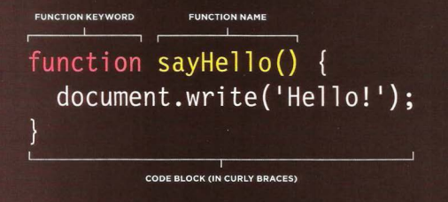
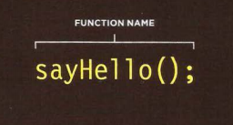
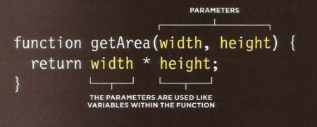
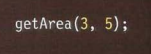
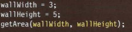

## JAVASCRIPT

<br/>
<br/>
<br/>


<br/>

## Functions

### ***`Function is chunk of code that contain one statement or more to do specific task, also Function organize  the code and prevents you from repeating yourself for ex: if you have task that you want to do it more than one time then you can add it to a function and call it when ever you want`***

<br/>

## Structure Of Function

> any function you want to add you must follow this structure: <br/> 1.  add function key word. <br/>  2. add name(best practice to be name refer to what function will do). <br/> 3. then open curly bracket and statements and close curly bracket. <br/> call function just type functionName()

<br/>



<br/>



<br/>

## Declaring Function Need Information And Return Value

<br/>

**`From Pictures below you will understand the mechanism`**

<br/>



<br/>

- [X] We have parameters as values
> 
- [X] We have parameters as variables
> 

<br/>

## ***You can assgine functions***
```
var x=functionName()

```