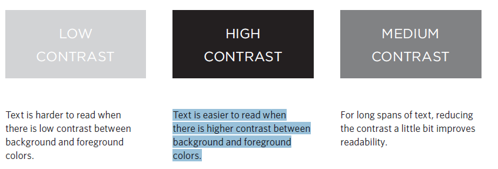

## CSS

 

 

> **CSS allows you to create rules that specify how the content of an element should appear.**

## We have rules to write valid CSS

 

* This rule indicates that all `
` elements should be shown in the Arial typeface.
* Selectors indicate which element the rule applies to.
The same rule can apply to more than one element if you
separate the element names with commas.
* Declarations indicate how the elements referred to in
the selector should be styled.

 

> CSS declarations sit inside curly brackets and each is made up of two parts: a property and a value, separated by a colon.     ` 1. Properties indicate the aspects of the element you want to
change. `  `2. Values specify the settings you want to use for the chosen properties.`

 

## Adding CSS to Html 

 #### ***We have three ways to add css:***

 * Inline : inside the tag ex: `
` but this way not recommended.
 * Internal : inside the head ex : ``.
 * External: link a file to html in head ex : `<link href="path" ref="styleshet">` this way best practice.

  

 ## CSS Selectors

 

 

 ## CSS priority

1. inline
2. important
3. id
4. class
5. Sequence of declaration.

 

## CSS Color

***`You have three ways to add color`***

 

* rgb values These express colors in terms of how much red, green and blue are used to make it up. For example: rgb(100,100,90).
* hex codes These are six-digit codes that represent the amount of red, green and blue in a color, preceded by a pound or hash # sign. For example: #ee3e80.
* color names There are 147 predefined color names that are recognized by browsers. For example: DarkCyan

> Color : to change text color.
> background-color : to chnage background color.
> opacity, rgba 

* Contrast : When picking foreground and background colors, it is important to ensure that there is
enough contrast for the text to be legible.

 

 

## hsl, hsla

**`The hsl color property has been introduced in CSS3 as an
alternative way to specify colors. The value of the property starts with the letters hsl, followed by individual values inside parentheses for:`**

* hue This is expressed as an angle
(between 0 and 360 degrees).
* saturation This is expressed as a percentage.
* lightness This is expressed as apercentage with 0% being white, 50% being normal, and 100% being black.
* alpha This is expressed as a number between 0 and 1.0.
For example, 0.5 represents 50% transparency, and 0.75 represents 75% transparency.