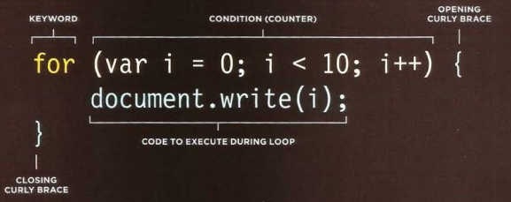

## JAVASCRIPT

<br/>
<br/>
<br/>


<br/>

## Comparison operators and Equivalent conditionals

<br/>

**There are two components to divide:**

1. an expression is evaluated
   > ex : var t= 5<6;
1. a conditional statements
    > ex : if(5<3)

<br/>

**image below gives you a clue for some Comparison operators and Equivalent conditionals** 

<br/>


<br/>

## Logical operators


<br/>


<br/>

**for NOT operator (!) is just reverse the value**

## Examples

<br/>

> ( (2 > 3) && ( 5<6 ) ) -> False

> ( (2 > 3) || ( 5<6 ) ) -> True

> !(4 < 5) -> False

## LOOPS

<br/>

**Loop is a chunk of code that allows you to repeat printing or calculate or whatever you want, depend on condition as long as true**

<br/>

#### We have three types of loops:

* for : we use it when we know how many we want to repeat statements inside the loop
 > 

 * while : we use it when we not know who will repeat the statements 
 
 ``` 

  while(condition)
 {

     check condition
 }
 ```

 * do while : same with while but will execute statement at lest once even condition is false
 
 ``` 
  do
 {

     check condition
 }while(condition)
 ```