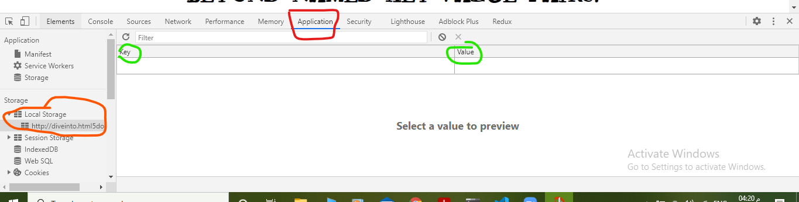

# LocalStorage

**` local storage is one of the areas where native client applications have held an advantage over web applications. For native applications, the operating system typically provides an abstraction layer for storing and retrieving application-specific data like preferences or runtime state. These values may be stored in the registry, INI files, XML files, or some other place according to platform convention. If your native client application needs local storage beyond key/value pairs, you can embed your own database, invent your own file format, or any number of other solutions.`**


## Cookies

* Cookies are included with every HTTP request, thereby slowing down your web application by needlessly transmitting the same data over and over
* Cookies are included with every HTTP request, thereby sending data unencrypted over the internet (unless your entire web application is served over SSL)
* Cookies are limited to about 4 KB of data — enough to slow down your application (see above), but not enough to be terribly useful

## What we really want is

1. a lot of storage space
on the client
1. that persists beyond a page refresh
1. and isn’t transmitted to the server


## Localstorage

<br/>

**So what is HTML5 Storage? Simply put, it’s a way for web pages to store named key/value pairs locally, within the client web browser.**

## Access LocalStorage

```
var foo = localStorage.getItem("bar");

localStorage.setItem("bar", foo);


// Another way 

var foo = localStorage["bar"];

localStorage["bar"] = foo;
```

## where Can Access LocalStorage

