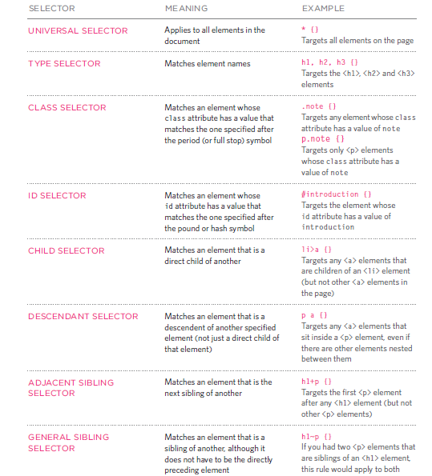

# `Html`

* Structural markup: the elements that you can use to
describe both headings and paragraphs
* Semantic markup: which provides extra information; such
as where emphasis is placed in a sentence, that something
you have written is a quotation (and who said it), the
meaning of acronyms, and so on.


## `Headings`

HTML has six "levels" of headings:

<br/> 

`<h1>` is used for main headings.
`<h2>` is used for subheadings.


<br/>

## `Paragraphs`


`<p>ali</p>`


## `Bold & It alic`

`<i>` --> <i>ali</i>

`<b>` --> <b>ali</b>


## `Superscript & Subscript`

`<sub>` --> H<sub>2</sub>O

`<sup>` --> H<sup>2</sup>

## `Line Breaks & Horizontal Rules`

`<br/>` to add new line

`<hr/>` to add horizontal rule

## `Semantic Markup`

**There are some text elements that are not intended to affect the structure of your web pages, but they do add extra information to the pages — they are known as semantic markup. ex `<em>` `<blokquet>`**  

## `Strong & Emphasis`

> `<strong>`: The use of the `<strong>` element indicates that its content has strong importance.
> `<em>` The `<em>` element indicates emphasis that subtly changes the meaning of a sentence.


## `Quotations`

> `<blockquote>` The `<blockquote>` element is used for longer quotes that take up an entire paragraph. Note
how the `<p>` element is still used inside the `<blockquote>` element.

> `<q>` The `<q>` element is used for shorter quotes that sit within a paragraph.

## `Abbreviations &Acronyms`

> `<abbr>` html HTML If you use an abbreviation or
an acronym, then the `<abbr>` element can be used.

## `Citations & Definitions`

> `<cite>` When you are referencing a piece of work such as a book, film or research paper, the `<cite>` element can be used to indicate where the citation is from.

> `<dfn>` The first time you explain some new terminology (perhaps an academic concept or some jargon) in a document, it is known as the defining instance of it.

## `Auth or Details`

> `<address>` 02/address.html HTML The `<address>` element has quite a specific use: to contain contact details for the author of the page.

## `Changes to Content`

> `<ins> <del>` The `<ins>` element can be used to show content that has been inserted into a document, while
the `<del>` element can show text that has been deleted from it.

> `<s>` The `<s>` element indicates something that is no longer accurate or relevant (but that should not be deleted).

## `CSS`

<br/>


<br/>

> **CSS allows you to create rules that specify how the content of an element should appear.**


## We have rules to write valid CSS


<br/>

* This rule indicates that all `<p>` elements should be shown in the Arial typeface.
* Selectors indicate which element the rule applies to.
The same rule can apply to more than one element if you
separate the element names with commas.
* Declarations indicate how the elements referred to in
the selector should be styled.


<br/>

> CSS declarations sit inside curly brackets and each is made up of two parts: a property and a value, separated by a colon. <br/>  <br/>` 1. Properties indicate the aspects of the element you want to
change. `<br/> `2. Values specify the settings you want to use for the chosen properties.`

<br/>

## Adding CSS to Html 

 #### ***We have three ways to add css:***

 * Inline : inside the tag ex: `<p style="color:red">` but this way not recommended.
 * Internal : inside the head ex : `<style> p{color:red;} </style>`.
 * External: link a file to html in head ex : `<link href="path" ref="styleshet">` this way best practice.

 <br/>

 ## CSS Selectors

<br/>



<br/>

 ## CSS priority


1. inline
2. important
3. id
4. class
5. Sequence of declaration.


<br/>

**Css is inhretence**

## `JAVASCRIPT`

<br/>
<br/>
<br/>


## **Javascript is a programing language that you can use it to make webpage more dynamic and interactive, also you can use it to manipulates and adjust css and html tags.** 


### `Examples :`

* Change attrubites (id, style , class...  etc).
* Change text inside tages and get text.
* Add event listner (click, hover .... etc).
* Add enimation (slidup, shake).
* Add information from forms and validate inputs.


## `Before starting write code please take those steps:`

1. DEFINE THE GOAL: First, you need to define the task you want to achieve.
1. ESIGN THE SCRIPT: To design a script you split the goal out into a series of tasks.
1. CODE EACH STEP: Each of the steps needs to be written in a programming language that the compu ter
understands. 
1. Use flowcharts: Arrows show how the script moves from one task to the next. The different shapes represent diff€rent types of tasks.


<br/>


<br/>

## `RULES FOR NAMING VARIABLES`

***We have rules to name varibales:***

* It must start with letter, $ , _.
* It can contain letters,numbers, dollar sign ($),or an underscore (_).
* You cannot use keywords or reserved words (var , function ... etc)
* javascript is a case sensitive small letter is different from capital.


## `Array`

> to declering javascript you can just use one of tow way

`var x=[]`

`var x= new Array()`


## `EXPRESSIONS`
<br/>

> var x= 55;

<br/>

## `OPERATORS`

<br/>

> var x= 5>5;
> var x= 5==5;
> var x= (5 > 3) && (2 < 4);
> var x= "odai" + 23

<br/>


## `Logical operators`


<br/>


<br/>

**for NOT operator (!) is just reverse the value**

## Examples

<br/>

> ( (2 > 3) && ( 5<6 ) ) -> False

> ( (2 > 3) || ( 5<6 ) ) -> True

> !(4 < 5) -> False

## `LOOPS`

<br/>

**Loop is a chunk of code that allows you to repeat printing or calculate or whatever you want, depend on condition as long as true**

<br/>

#### `We have three types of loops:`

* for : we use it when we know how many we want to repeat statements inside the loop
 > 

 * while : we use it when we not know who will repeat the statements 
 
 ``` 

  while(condition)
 {

     check condition
 }
 ```

 * do while : same with while but will execute statement at lest once even condition is false
 
 ``` 
  do
 {

     check condition
 }while(condition)
 ```