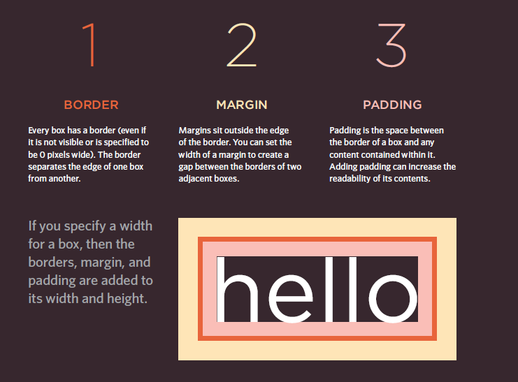
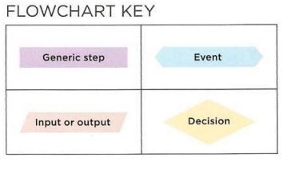
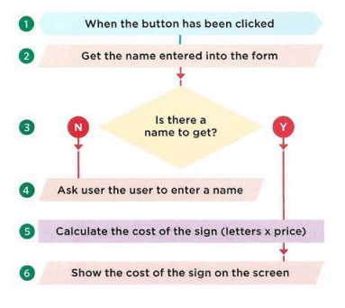
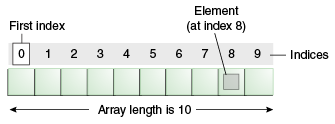
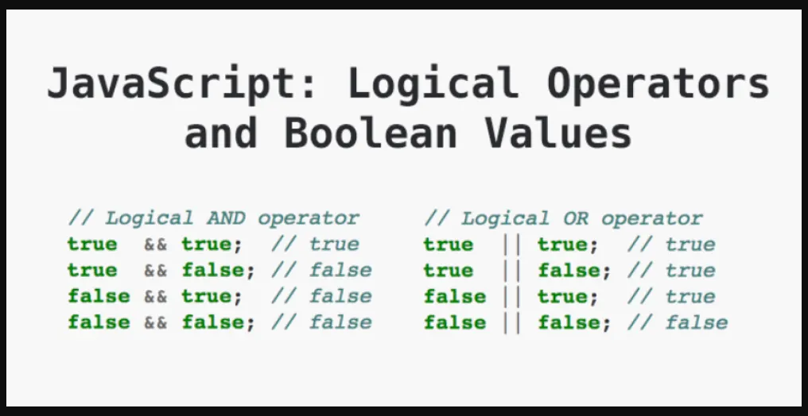
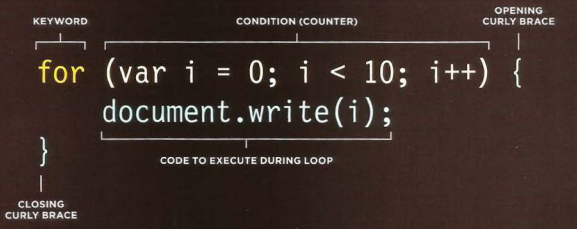

# `Html`


* Ordered lists are lists where each item in the list is numbered. For example, the list might be a set of steps for
a recipe that must be performed in order, or a legal contract where each point needs to be identified by a section
number.
* Unordered lists are lists that begin with a bullet point (rather than characters that indicate order).
* Definition lists are made up of a set of terms along with the definitions for each of those terms.


# `Ordered Lists && Unordered`

> `<ol>` The ordered list is created with the `<ol>` element.
> `<li>` Each item in the list is placed between an opening `<li>` tag and a closing `</li>` tag. (The li stands for list item.

> `<ul>` The unordered list is created with the `<ul>` element.

# `Definition Lists`

> `<dl>` The definition list is created with the `<dl>` element and usually consists of a series of terms and their definitions.

> Inside the `<dl>` element you will usually see pairs of `<dt>` and `<dd>` elements.
`<dt>` This is used to contain the term being defined (the definition term). 

> `<dd>`This is used to contain the definition.


# `Box Dimensions`

> width, height : specifiy height and width

> min-width, max-width : specifiy max-width and min-width

> min-height, max-height : specifiy max-height and min-height

> overflow : add scroll bar


# `Border, Margin & Padding`





* margin-left
* margin-right
* margin-top
* margin-bottom
* padding-left
* padding-right
* padding-top
* padding-bottom
* border-width
* border-style
* border-color

# `display`

* inline This causes a block-level
element to act like an inline element.
* block This causes an inline element to act like a block-level element.

* inline-block This causes a block-level element to flow like an inline element, while retaining other features of a block-level element.

* none This hides an element from the page. In this case, the element
acts as though it is not on the
page at all (although a user could
still see the content of the box if
they used the view source option
in their browser).


> visibility : hide or show content

> border-image adding border like amage

> box-shadow to add shadow

> border-radius 

## `JAVASCRIPT`

<br/>
<br/>
<br/>


## **Javascript is a programing language that you can use it to make webpage more dynamic and interactive, also you can use it to manipulates and adjust css and html tags.** 


### `Examples :`

* Change attrubites (id, style , class...  etc).
* Change text inside tages and get text.
* Add event listner (click, hover .... etc).
* Add enimation (slidup, shake).
* Add information from forms and validate inputs.


## `Before starting write code please take those steps:`

1. DEFINE THE GOAL: First, you need to define the task you want to achieve.
1. ESIGN THE SCRIPT: To design a script you split the goal out into a series of tasks.
1. CODE EACH STEP: Each of the steps needs to be written in a programming language that the compu ter
understands. 
1. Use flowcharts: Arrows show how the script moves from one task to the next. The different shapes represent diff€rent types of tasks.



<br/>



<br/>

## `RULES FOR NAMING VARIABLES`

***We have rules to name varibales:***

* It must start with letter, $ , _.
* It can contain letters,numbers, dollar sign ($),or an underscore (_).
* You cannot use keywords or reserved words (var , function ... etc)
* javascript is a case sensitive small letter is different from capital.


## `Array`

> to declering javascript you can just use one of tow way

`var x=[]`

`var x= new Array()`



# `EXPRESSIONS`
<br/>

> var x= 55;

<br/>

## `OPERATORS`

<br/>

> var x= 5>5;
> var x= 5==5;
> var x= (5 > 3) && (2 < 4);
> var x= "odai" + 23

<br/>


## `Logical operators`


<br/>



<br/>

**for NOT operator (!) is just reverse the value**

## Examples

<br/>

> ( (2 > 3) && ( 5<6 ) ) -> False

> ( (2 > 3) || ( 5<6 ) ) -> True

> !(4 < 5) -> False

## `LOOPS`

<br/>

**Loop is a chunk of code that allows you to repeat printing or calculate or whatever you want, depend on condition as long as true**

<br/>

#### `We have three types of loops:`

* for : we use it when we know how many we want to repeat statements inside the loop
 > 

 * while : we use it when we not know who will repeat the statements 
 
 ``` 

  while(condition)
 {

     check condition
 }
 ```

 * do while : same with while but will execute statement at lest once even condition is false
 
 ``` 
  do
 {

     check condition
 }while(condition)
 ```

 # `Switch`


```
 switch(condition)
 {
     case '' :
     break;

     defult;
 }