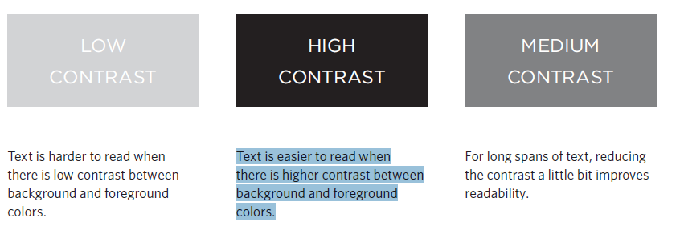

## CSS Color

***`You have three ways to add color`***

<br/>

* rgb values These express colors in terms of how much red, green and blue are used to make it up. For example: rgb(100,100,90).
* hex codes These are six-digit codes that represent the amount of red, green and blue in a color, preceded by a pound or hash # sign. For example: #ee3e80.
* color names There are 147 predefined color names that are recognized by browsers. For example: DarkCyan


> Color : to change text color.
> background-color : to chnage background color.
> opacity, rgba 

* Contrast : When picking foreground and background colors, it is important to ensure that there is
enough contrast for the text to be legible.

<br/>



<br/>

## hsl, hsla


**`The hsl color property has been introduced in CSS3 as an
alternative way to specify colors. The value of the property starts with the letters hsl, followed by individual values inside parentheses for:`**

* hue This is expressed as an angle
(between 0 and 360 degrees).
* saturation This is expressed as a percentage.
* lightness This is expressed as apercentage with 0% being white, 50% being normal, and 100% being black.
* alpha This is expressed as a number between 0 and 1.0.
For example, 0.5 represents 50% transparency, and 0.75 represents 75% transparency.

## Text

> font-family : The font-family property allows you to specify the typeface that should be used for any text inside the element(s) to which a CSS rule applies.

> font-size : The font-size property enables you to specify a size for the
font. There are several ways to specify the size of a font. The most common are: pixels,percentages,ems.

> @font-face allows you to use a font, even if it is not installed on the computer of the person browsing, by allowing you to specify a path to a copy of the font, which will be downloaded if it is not on the user's machine.

> font-weight : The font-weight property allows you to create bold text. There are two values that this property commonly takes.

> font-style : If you want to create italic text, you can use the font-style
property. There are three values this property can take.

> text-transform: The text-transform property is used to change the case of
text giving it one of the following values: uppercase,lowercase,capitalize.

> text-decoration : The text-decoration property allows you to specify the
following values: none,underline,overline,line-through,blink.

> line-height : Leading (pronounced ledding) isa term typographers use for the
vertical space between lines of text. In a typeface, the part of a letter that drops beneath the baseline is called a descender, while the highest point of a letter is called the ascender. Leading is measured from the bottom of
the descender on one line to the top of the ascender on the next.

> letter-spacing, word-spacing : Kerning is the term typographers use for the space between each letter. You can control the space between each letter with the letter-spacing property.
> text-align : left,right ... etc.

> vertical-align : baseline,sub,super,top,text-top,middle,bottom,text-bottom.

> text-indent : The text-indent property allows you to indent the first line of text within an element.

> :hover, :active, :focus : To add effect on it.


## Images

**If you are building a site from scratch, it is good practice to create a folder for all of the images the site uses.**

> Adding img to your site : ``````.

> width & height in px.

> align: center, left, right.

> virtical-align : top,bottom,....ect.

> use jpg,png,git.

> ```<figure> <figcaption>```

