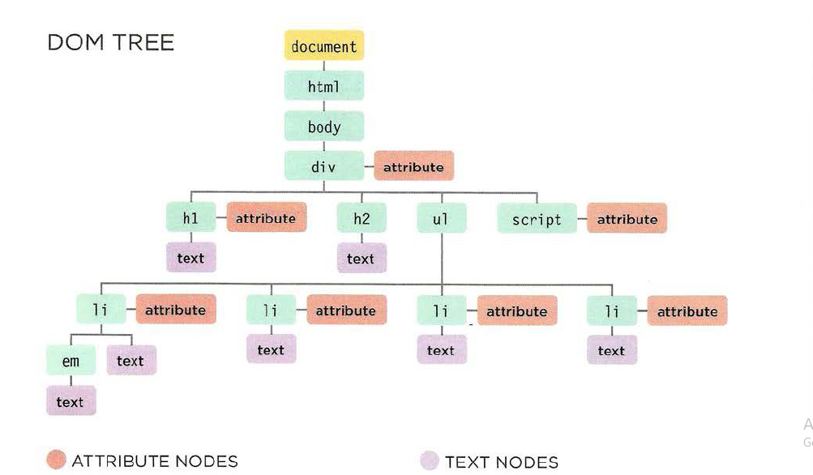
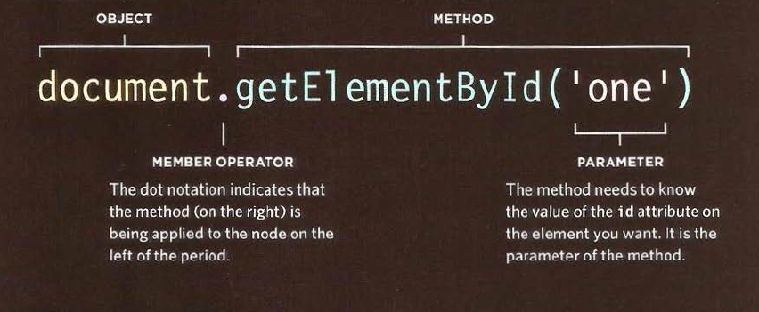
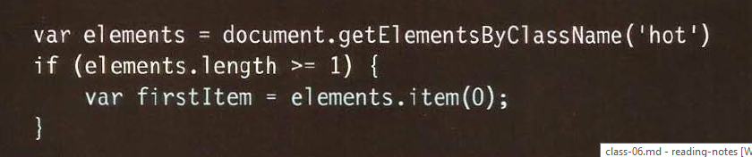
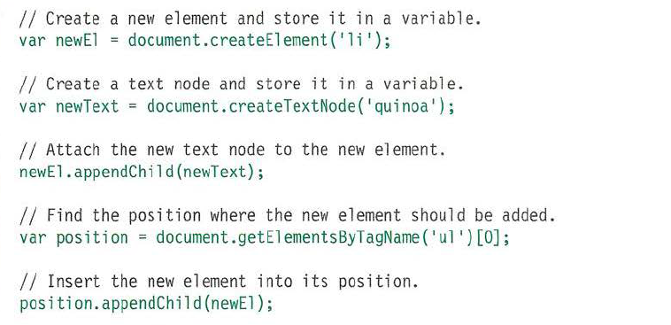

# Javascript 


## Objects

**Objects group together a set of variables and functions to create a modelof a something you would recognize from the real world. In an object, variables and functions take on new names.**

> In method we have proparites and methods insted of nameing function and varibales.

```
let boj={
    name:'odai',
    age:'30',
    calculateSalary: ()=>{
        .......
        return ...
    }
}
```


## The Document Object Model (DOM)

**The Document Object Model (DOM) specifies how browsers should create a model of an HTML page and how JavaScript can access and update the contents of a web page while it is in the browser window.**





1. > SELECT AN INDIVIDUAL ELEMENT NODE:
    get El ement Byld ()
    querySe 1 ector ()
1. > SELECT MULTIPLE ELEMENTS (NODELISTS):
    getElementsByClassName()
    getElementsByTagName()
    querySelectorAll()
1. > TRAVERSING BETWEEN ELEMENT NODES:
    parentNode
    previousSibl ing / nextSibl ing
    firstChild / lastChild

## Elements

> nodeValue: This property lets you access or update contents of a text node.
> create Element()
  createTextNode()
  appendChi l d () / removeChi l d ()
> hasAttr i bute()
  getAttribute()
  setAttri bute()
  removeAttribute()

  

  <br/>

  
  

* innerHTML parses content as HTML, so it takes longer.
* nodeValue uses straight text, does not parse HTML, and is faster.
* textContent uses straight text, does not parse HTML, and is faster.
* innerText Takes styles into consideration. It won't get hidden text for instance.

  

  <br/>

  **`If you add HTML to a page  sing i nnerHTML (or several jQuery methods), you need to be aware of Cross-Site Scripting Attacks or XSS; otherwise, an attacker could gain access to your users' accounts.`**