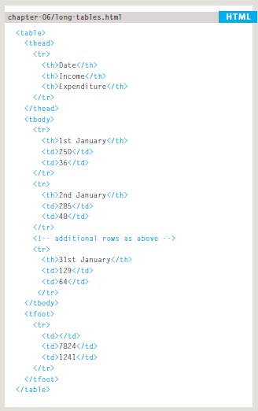
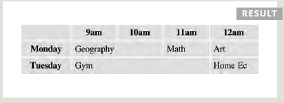
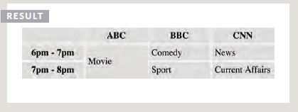
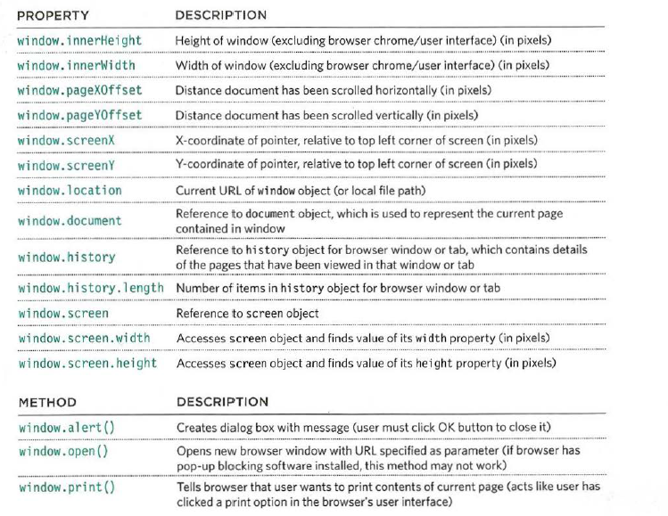
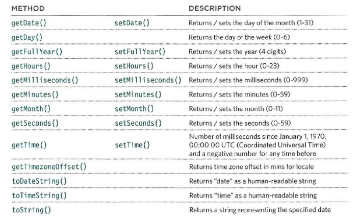

# Domain Modeling

**Domain modeling is the process of creating a conceptual model in code for a specific problem. A model describes the various entities, their attributes and behaviors, as well as the constraints that govern the problem domain. An entity that stores data in properties and encapsulates behaviors in methods is commonly referred to as an object-oriented model.**


# Tables

**A table represents information in a grid format. Examples of tables include financial reports, TV schedules, and sports results.**

# Table Structure

> `<table><td><tr><th><thead><tbody><tfoot>`



> `<td colspan="2">Geography</td>`



> `<td rowspan="2">Movie</td>`




# Old Code *Don't Use*

* Width & Spacing
* Border & Background

# Updating an object or call it

1. Object.name
1. Oblect['name']

1. Object.name="string"
1. Oblect['name']="string"

# Constructor

**Fro reusing " Don't repate your self "**
```
let Add = (name,age)=>
{
    this.name=name;
    this.age=age;
}
```

# Create New Object

```
let x=new Add('odai',33)
```
# Delete From Object

```
delete x.name;
```

# WAYS TO CREATE OBJECTS

```
let x= {};
let x= new Object();
```

# Built-in Object

1. Window
   > 
1. document
    > geetElementbyId ... etc
1. gloubl
    > Number, String ... etc

# Date

