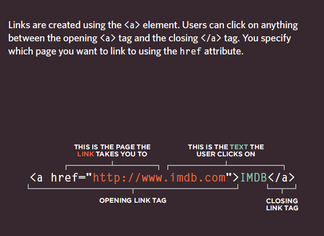

# Html

 

## Position

* Normal flow : Every block-level element appears on a new line, causing each item to appear lower down the page than the previous one.

* Relative Positioning :  This moves an element from the position it would be in normal flow, shifting it to the top, right,
bottom, or left of where it would have been placed.

* absolute positioning : This positions the element in relation to its containing element.

> position:static ==> In normal flow, each block-level element sits on top of the next one.

> position:relative ==> Relative positioning moves an element in relation to where it would have been in normal flow.

> position:absolute ==> When the position property is given a value of absolute, the box is taken out of normal flow and no longer affects the position of other elements on the page. (They act like it is not there.)

> position:fixed ==> Fixed positioning is a type of absolute positioning that requires the position property to have a value of fixed.

## z-index

**When you use relative, fixed, or bsolute positioning, boxes can overlap. If**

# float

**The float property allows you to take an element in normal flow and place it as far to the left or right of the containing element as possible.**

* float: left
* float: right

## Clear

**The clear property allows you to say that no element (within the same containing element) should touch the left or righthand sides of a box.**

* clear : left
* clear :right
* clear : none
* clear : both

## Screen Sizes
 
 **You need to use %**

 # import

 **@import some developer use this to siplet ther css files**