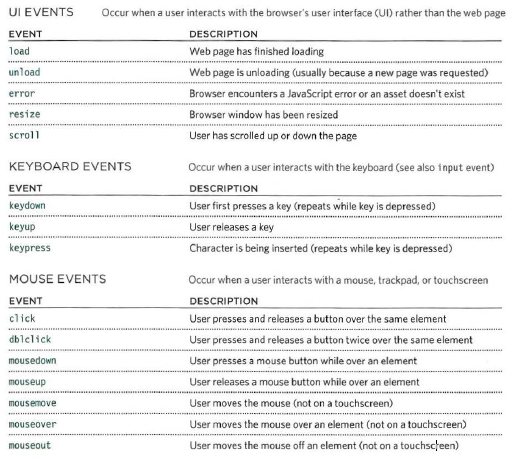

# Forms

**The best known form on the web is probably the search box that sits right in the middle of Google's homepage.**


## inputs 

* buttons
* text
* password
* textarea
* img
* fileupload
* dropbox
* checkbox
* fieldset

## structure

```
<form action='' method=''>
```

> Action : where the page will go
> method : the way you want to send data .... post,get,delete,put.


## input proparties 

1. maxlength
1. minlength
1. col
1. row
1. checked


# Css

1. list style
   > list-style-type 
   > list-style-image 
   > list-style-position
   > list-style
   > empty-cells
2. Table style
   >border-spacing
   >border-collapse


# Event



## How to use

1. > element.eventname= function
1. > addEventLestner('name of event' ,call back function)