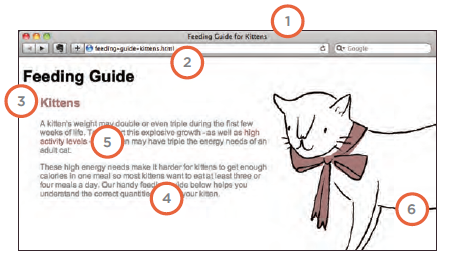
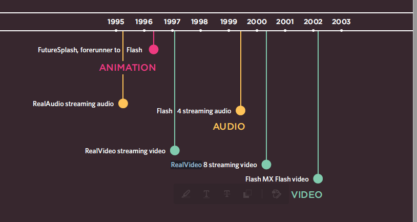
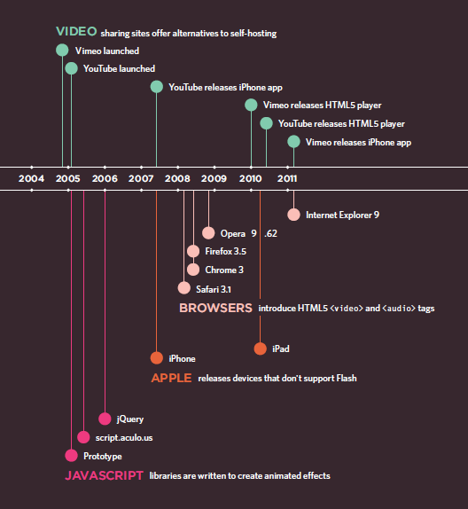

# Images

>You can change imges size by width and height proparity.

>You can use float and and margin to change posistion.

>you can change images to block level by display.

>You can use background-image : url() to change any tags background.

>background-repeat, background-attachment you can use them to identfiy how many repetation and behiaveor image.

>background-position you use this for let browes knows wher to start appling image

> shorthand 

>Image Rollovers & Sprites thant means using :hover and :active

# SEO

***SEO is a huge topic and several books have been ritten on the subject. The following pages will help you understand the key concepts so you can improve your website's visibility on search engines.***

> In every page of your website there are seven key places where keywords (the words people might search on to find your site) can appear in order to improve its findability.  
> 1.  Page Title
> 1. URL / Web Address
> 1. Headings
> 1. Text
> 1. Link Text
> 1. Image Alt Text
> 1. Page Descriptions
> 1. Image Alt Text


## How to Identify Keywords and Phrases

1. Brainstorm :
List down the words that
someone might type into
Google to find your site. Be sure
to include the various topics,
products or services your site is
about.

2. Organize: 
Group the keywords into
separate lists for the different
sections or categories of your
website.

3. Research : 
There are several tools that let
you enter your keywords and
then they will suggest additional
keywords you might like to
consider, such as:
adwords.google.co.uk/
select/KeywordToolExternal
www.wordtracker.com
www.keyworddiscovery.com

## Another question you have to answer

* How Many People Are Coming to Your Site?
* What Are Your Visitors Looking At?
* Where Are Your Visitors Coming From?

# Another TEcneques 
* Domain Names & Hosting.

* FT P & Third Party Tools.

## HTML5 video and audio

**The <video> and <audio> elements allow us to embed video and audio into web pages.**

```
<video controls>
  <source src="rabbit320.mp4" type="video/mp4">
  <source src="rabbit320.webm" type="video/webm">
  <p>Your browser doesn't support HTML5 video. Here is a <a href="rabbit320.mp4">link to the video</a> instead.</p>
</video>
```

> You can use CSS to modify Video and audio style.

## Flash

***Flash is a very popular technology used to add animations, video, and audio to websites. This chapter begins by looking at how to use it in your web pages.***

> Flash is and old way to add video or audio to website using swf but now no one use it, they use new tags of HTML5 `<video>` and `<audio>`   