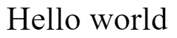
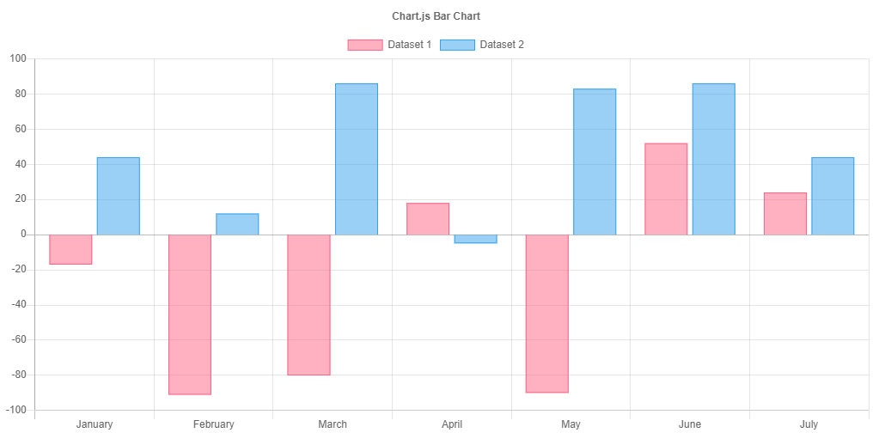

# Canvas

**The `<canvas>` element differs from an `` tag in that, like for `<video>`, `<audio>`, or `<picture>` elements, it is easy to define some fallback content, to be displayed in older browsers not supporting it, like versions of Internet Explorer earlier than version 9 or textual browsers. You should always provide fallback content to be displayed by those browsers.**


```
<!DOCTYPE html>
<html>
 <head>
  <meta charset="utf-8"/>
  <script type="application/javascript">
    function draw() {
      var canvas = document.getElementById('canvas');
      if (canvas.getContext) {
        var ctx = canvas.getContext('2d');

        ctx.fillStyle = 'rgb(200, 0, 0)';
        ctx.fillRect(10, 10, 50, 50);

        ctx.fillStyle = 'rgba(0, 0, 200, 0.5)';
        ctx.fillRect(30, 30, 50, 50);
      }
    }
  </script>
 </head>
 <body onload="draw();">
   <canvas id="canvas" width="150" height="150"></canvas>
 </body>
</html>
```

> 

# Drawing

>fillRect(x, y, width, height)
Draws a filled rectangle.

>strokeRect(x, y, width, height)
Draws a rectangular outline.

>clearRect(x, y, width, height)
Clears the specified rectangular area, making it fully transparent.

```
function draw() {
  var canvas = document.getElementById('canvas');
  if (canvas.getContext) {
    var ctx = canvas.getContext('2d');

    ctx.fillRect(25, 25, 100, 100);
    ctx.clearRect(45, 45, 60, 60);
    ctx.strokeRect(50, 50, 50, 50);
  }
}
```


# Color


> fillStyle used for change color

```
ctx.fillStyle = 'orange';
ctx.fillStyle = '#FFA500';
ctx.fillStyle = 'rgb(255, 165, 0)';
ctx.fillStyle = 'rgba(255, 165, 0, 1)';
```

# Drawing text

```
function draw() {
  var ctx = document.getElementById('canvas').getContext('2d');
  ctx.font = '48px serif';
  ctx.strokeText('Hello world', 10, 50);
}
```
> 

```
function draw() {
  var ctx = document.getElementById('canvas').getContext('2d');
  ctx.font = '48px serif';
  ctx.fillText('Hello world', 10, 50);
}
```

> 

# Creating a Chart

> `It's easy to get started with Chart.js. All that's required is the script included in your page along with a single <canvas> node to render the chart.`


```
<canvas id="myChart" width="400" height="400"></canvas>
<script>
var ctx = document.getElementById('myChart').getContext('2d');
var myChart = new Chart(ctx, {
    type: 'bar',
    data: {
        labels: ['Red', 'Blue', 'Yellow', 'Green', 'Purple', 'Orange'],
        datasets: [{
            label: '# of Votes',
            data: [12, 19, 3, 5, 2, 3],
            backgroundColor: [
                'rgba(255, 99, 132, 0.2)',
                'rgba(54, 162, 235, 0.2)',
                'rgba(255, 206, 86, 0.2)',
                'rgba(75, 192, 192, 0.2)',
                'rgba(153, 102, 255, 0.2)',
                'rgba(255, 159, 64, 0.2)'
            ],
            borderColor: [
                'rgba(255, 99, 132, 1)',
                'rgba(54, 162, 235, 1)',
                'rgba(255, 206, 86, 1)',
                'rgba(75, 192, 192, 1)',
                'rgba(153, 102, 255, 1)',
                'rgba(255, 159, 64, 1)'
            ],
            borderWidth: 1
        }]
    },
    options: {
        scales: {
            yAxes: [{
                ticks: {
                    beginAtZero: true
                }
            }]
        }
    }
});
</script>
```

> 

# Refrencing


* [Basic usage](https://developer.mozilla.org/en-US/docs/Web/API/Canvas_API/Tutorial/Basic_usage)

* [Drawing shapes](https://developer.mozilla.org/en-US/docs/Web/API/Canvas_API/Tutorial/Drawing_shapes)

* [Applying styles and colors](https://developer.mozilla.org/en-US/docs/Web/API/Canvas_API/Tutorial/Applying_styles_and_colors)

* [Drawing text](https://developer.mozilla.org/en-US/docs/Web/API/Canvas_API/Tutorial/Drawing_text)

* [Chart.js](https://www.chartjs.org/docs/latest/)


