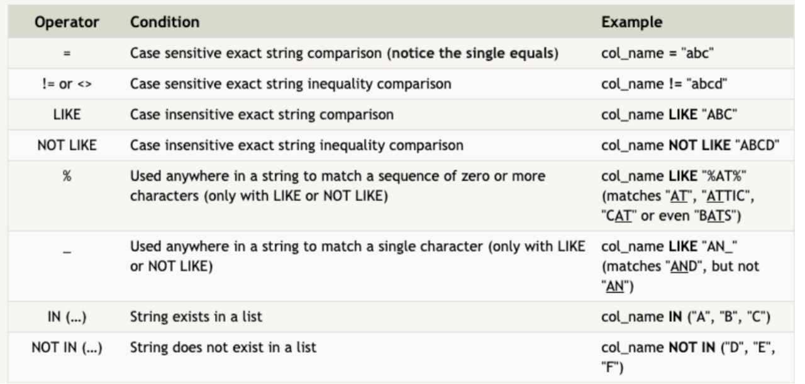
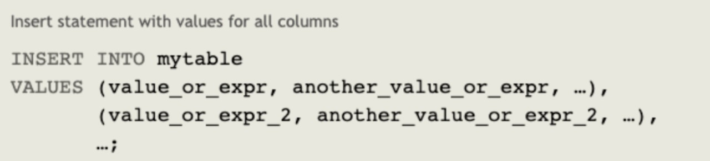

# Class 08 

## References

https://sqlbolt.com/lesson/select_queries_introduction

## What is SQL?

- Structured Query Language
    - is a language designed to allow users to query, manipulate, and transform data 

- To retrieve data from a SQL database
    - SELECT statements
    - colloquially refered to as queries
- to filter certain results from being returned, 
    - use a WHERE clause in the query
- constraints:

- to discard rows that have a duplicate column value
    - DISTINCT keyword.

- Inserting rows
    - 

- Updating rows
    - UPDATE statement
    - ``UPDATE mytable
SET column = value_or_expr, 
    other_column = another_value_or_expr, 
    …
WHERE condition;``

- Deleting rows
    - ``DELETE FROM mytable
WHERE condition;``

- Creating tables 
    - ``CREATE TABLE IF NOT EXISTS mytable (
    column DataType TableConstraint DEFAULT default_value,
    another_column DataType TableConstraint DEFAULT default_value,
    …
);``

- Altering tables
    - ``ALTER TABLE mytable
ADD column DataType OptionalTableConstraint 
    DEFAULT default_value;``

- Dropping tables
    - ``DROP TABLE IF EXISTS mytable;``